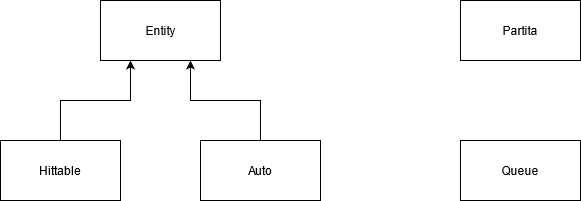

# Documentazione Project-Mercury

## Principali scelte implementative
L'idea iniziale è stata quella di creare una matrice NxN contenente tutti i caratteri del gioco, ma questa implementazione è stata scartata in quanto durante il moveDown(), che sposta gli Hittable (boost e ostacoli) in basso dando l'impressione che l'auto si sposti in avanti, molte operazioni risultavano inutili in quanto spostavano un carattere vuoto (uno spazio) verso il basso al posto di un altro carattere vuoto, rendendo il costo della funzione quadratico (O(N^2)) e impattando visibilmente sulle performance di gioco.
Per questo si ha scelto di abbandonare la matrice e usare due code come struttura per la gestione degli Hittable, in quanto questi compaiono dall'alto e scompaiono dal basso tramite una logica FIFO. In questo modo l'operazione moveDown() è passata da avere costo quadratico a costo lineare, in quanto esso è proporzionale soltanto al numero di ostacoli presenti sul campo, che a sua volta è proporzionale soltanto all'altezza del campo (O(n)).
Inoltre l'unica differenza tra boost e ostacoli è se il punteggio associato viene aggiunto o sottratto dal punteggio attuale, per questo sono implementati entrambi la classe Hittable. Inoltre la gestione della stampa è identica per ogni elemento su schermo, per questo sia Hittable e Auto sono sottoclassi di Entity.

    

## Table of contents
1. [ Main.cpp ](#main)
2. [ Partita.cpp ](#partita)
3. [ Auto.cpp ](#auto)
4. [ Entity.cpp ](#entity)
5. [ Hittable.cpp ](#hittable)
6. [ Queue.cpp ](#queue)
7. [ setCursorPosition.cpp ](#setCursorPosition)

## Main.cpp
Il main.cpp ha il compito di fare il setup delle impostazioni del terminale, come la dimensione e la rimozione del cursore lampeggiante. Inoltre visualizza su schermo la schermata iniziale, per poi avviare la partita creandone un'istanza della classe e usando il metodo Partita::start(), a cui viene passato il controllo.

## Partita.cpp
Partita.cpp è la classe che si occupa della gestione dei diversi componenti di gioco e la loro interazione. Contiene anche le informazioni relative al punteggio e al livello. Si ha scelto di usare questa classe e non usare il main in modo tale da renderne i metodi indipendenti in caso si volesse usare il gioco in contesti diversi da questo, in cui basterebbe importare la classe Partita e le altre di conseguenza.

La classe contiene le seguenti funzioni pubbliche:

 - **Partita(int l, int h)**: è il costruttore; prende in input la lunghezza e l'altezza del campo. Si occupa di inizializzare le variabili e istanziare la classe Auto e le due Queue.
 - **start()**: contiene un ciclo while il quale richiama il metodo per la lettura degli input, per la stampa, per la gestione del punteggio, per la gestione degli ostacoli e dei boost. Il ciclo termina quando il punteggio diventa negativo.

Gli attributi privati sono:

 - **int length**: lunghezza del campo.
 - **int height**: altezza del campo.
 - **int punti**: punteggio attuale della partita.
 - **int maxPunti**: punteggio massimo raggiunto nella partita.
 - **int x, y**: coordinate dell'auto; la y è fissa in quanto l'auto viene posizionata in fondo al campo di gioco, mentre la x viene modificata in relazione agli input dell'utente.
 - **int input**: l'input dell'utente.
 - **Auto a**: istanza dell'auto.
 - **Queue obsQueue**: la coda che contiene gli ostacoli.
 - **Queue boostQueue**: la coda che contiene i boost.
 - **uint64_t t**: il tempo in millisecondi (since epoch, Jan 1 1970).
 - **uint64_t delay**: il delay tra due tick di gioco.
 - **int livello**: livello attuale.
 - **int danno**: il danno degli ostacoli calcolato in base al livello, verrà passato alla classe Hittable per la creazione di un ostacolo.

Le funzioni private sono:

 - **void bordo()**: stampa il bordo del campo.
 - **void stampaInfo()**: stampa le informazioni di gioco. Le informazioni sono: il numero di ostacoli presenti sul campo, il numero di boost presenti sul campo, se è avvenuta una collisione, il punteggio attuale, il livello attuale, il danno che provocano gli ostacoli, il delay tra due tick di gioco e il punteggio massimo raggiunto.
 - **int getRandomX()**: ritorna una coordinata x random, serve per lo spawn di ostacoli e boost.
 - **int getRandomSpawn()**: calcola la probabilità con cui un boost verrà spawnato.
 - **void queueManager()**: gestisce la creazione degli ostacoli e dei boost, la loro aggiunta in coda, il loro spostamento nel campo, il loro despawn e il check delle collisioni con l'auto.
 - **void stampa()**: stampa gli ostacoli e i boost sul campo richiamando i metodi di Queue.
 - **void processInput(int c)**: modifica la coordinata x dell'auto in base all'input c dell'utente.
 - uint64_t time(): ritorna il time_since_epoch in ms.
 - **void levelsManager()**: aggiorna il livello in base al punteggio e il delay e il danno in base al livello.
 - **void checkBound()**: controlla se l'auto colpisce il bordo modificando il punteggio di conseguenza.
 - **void end()**: mostra la schermata finale di gioco con il punteggio massimo raggiunto.

## Auto.cpp
Rappresenta il veicolo ed è sottoclasse di Entity.

Le funzioni pubbliche sono:

 - **Auto()**: costruttore di default.
 - **Auto(int x, int y)**: costruttore che prende in input la posizione dell'auto nel campo.
 - **void processInput(int c, int length)**: prende in ingresso l'input da tastiera c e la lunghezza del campo e modifica la coordinata x dell'auto di conseguenza.

Non contiene funzioni o attributi privati.

## Entity.cpp
È la classe padre di Auto e di Hittable. Si occupa della gestione della posizione degli elementi su schermo, della loro visualizzazione grafica e della stampa. Contiene la posizione e un buffer per la posizione precedente, in modo tale che durante la nuova stampa del carattere nella posizione precendente venga stampato uno spazio.

Gli attributi e le funzioni protected sono:

 - **struct Pos**: definizione della struttura che contiene le coordinate x e y.
 - **Pos pos**: le coordinate attuali dell'Entity.
 - **Pos buffer**: le coordinate dell'Entity precedenti a quella attuale.
 - **int color**: il valore del colore di stampa del carattere.
 - **char c**: il carattere di stampa che rappresenta l'Entity.
 - **void setChar(char _c)**: imposta il carattere di stampa c.
 - **void setColor(int _color)**: imposta il colore di stampa del carattere.

Le funzioni pubbliche sono:

 - **Entity()**: costruttore di default.
 - **Entity(int x, int y, char _c, int _color)**: costruttore a cui vengono passate le coordinate x e y, il carattere di stampa e il colore del carattere.
 - **Entity(int x)**: costruttore a cui viene passato solamente la coordinata x. Viene utilizzato dalla classe Hittable.
 - **int getX()**: ritorna la coordinata x.
 - **int getY()**: ritorna la coordinata y.
 - **int getBufferX()**: ritorna la coordinata x della posizione bufferizzata.
 - **int getBuggerY()**: ritorna la coordinata y della posizione bufferizzata.
 - **void setPos(int x, int y)**: imposta le coordinate x e y.
 - **void setPos(int x)**: imposta soltanto la coordinata x.
 - **void setBuffer()**: salva la posizione attuale nel buffer.
 - **char getChar()**: ritorna il carattere c.
 - **void stampa()**: stampa il carattere nella posizione attuale e stampa uno spazio nella posizione del buffer.
 - **int getColor()**: ritorna il valore del colore.

## Hittable.cpp
È sottoclasse di Entity ed è la classe con cui vengono istanziati boost e ostacoli.
L'unica differenza tra un boost e un ostacolo è quella di aggiungere o togliere punti, per questo è stato scelto di implementare un'unica classe dove un booleano permette di scegliere se l'istanza rappresenterà un ostacolo o un boost.

Gli attributi privati sono:

 - **int points**: quanti punti l'Hittable toglie o aggiunge al punteggio in base a se è rispettivamente un ostacolo o un boost.

Le funzioni pubbliche sono:

 - **Hittable()**: costruttore di default.
 - **Hittable(int x, int p, bool ostacolo)**: costruttore che prende in input la coordinata x, il punteggio p relativo all'Hittable e un booleano che indica se è un ostacolo o un boost.
 - **int getPoints()**: ritorna il punteggio.
 - **void setPoints(int p)**: imposta il punteggio.
 - **void moveDown()**: modifica la posizione dell'Hittable spostandolo di una unità in basso.

## Queue.cpp
È la classe utilizzata per la gestione dei boost e degli ostacoli all'interno del gioco.
Il motivi principali per cui è stata scelta una coda sono la sua semplicità ed efficienza in questo specifico contesto, al contrario di altre possibili implementazioni, che seppur corrette, sarebbero state di una complessità superiore a quella necessaria.

Il campo protected contiene:

 - **struct Node**: per ogni entità viene creato un nodo composto dall'entità stessa e un puntatore al nodo successivo.
 - **qN* head / tail / tmp**: puntatori di tipo nodo inizializzati a NULL.
 - **int dim**: dimensione della coda.

I metodi pubblici sono:

 - **Queue()**: costruttore default della coda.
 - **int getDim()**: funzione che restituisce tramite intero la dimensione dell coda.
 - **void enQ(Hittable e)**: metodo per l'aggiunta di elementi nella coda.
 - **void deQ()**: metodo per la rimozione degli elementi dalla coda.
 - **Hittable getTesta()**: restituisce l'elemento in testa.
 - **void move()**: aggiorna la posizione degli elementi nella coda.
 - **void print()**: stampa degli elementi in coda.
 - **checkLimit(int l)**: controllo dell'altezza di ogni elemento in confronto al limite l.
 - **checkCollision(int x, int y)**: restituisce un valore di verità se le coordinate dell'elemento in testa coincidono con quelle passate. 

## setCursorPosition.cpp
Racchiude diversi metodi per la gestione degli input e della visualizzazione su terminale. Non è una classe.

 - **void setCursorPosition(int x, int y, int _color)**: metodo che si occupa del posizionamento del cursore nelle coordinate passate in input e del colore.
 - **int getInput()**: ritorna il carattere passato in input da tastiera con getch().
 - **void cls()**: effettua il clear screen ma in maniera più veloce.
